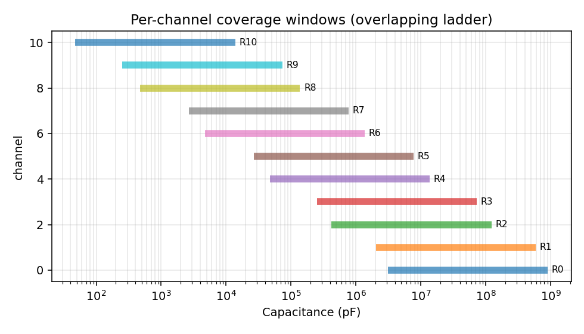
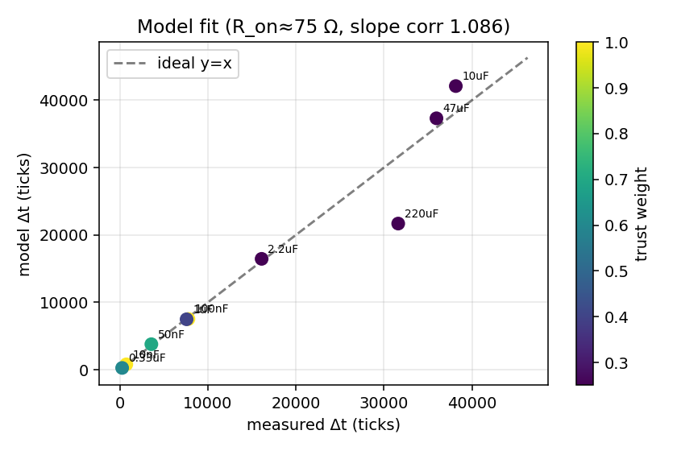

# Introduction

A microcontroller cannot read capacitance directly, but it can **measure time**
with great precision. This instrument therefore converts the unknown
capacitance into a time interval — using nothing more exotic than a resistor
charging a capacitor — and counts that interval with a hardware timer. The
design's value lies in arranging the measurement so the result depends only on
quantities we know well (a resistor and a clock) and not on those we do not
(the exact supply, the comparator's switching point, or temperature).

The report is organised as a standard development narrative: the measurement
**theory** and the case for automatic ranging (§2); the **design and
implementation** — architecture, pin-level operation, and the range-search
algorithm (§3); the **calibration methodology** (§4); the measured **results**
(§5); a **discussion and error analysis**, including a calibration simulation
(§6); a **comparison with professional instruments** (§7); and **conclusions**
(§8).

# Theory: the measurement principle

## The RC step response

Consider a capacitor $C$ charged from a constant source $V_{cc}$ through a
series resistor $R$. The node voltage $v(t)$ obeys the first-order linear
differential equation

$$
R\,C\,\frac{dv}{dt} + v(t) = V_{cc},
$$

whose solution, for an initially discharged capacitor, is the well-known
exponential approach

$$
v(t) = V_{cc}\left(1 - e^{-t/RC}\right).
$$ {#eq-step}

The product $\tau = RC$ is the **time constant**: the time for the node to reach
$1 - e^{-1} \approx 63.2\%$ of $V_{cc}$. Because the output is taken *across the
capacitor*, the network is a first-order **low-pass filter** — the capacitor
voltage cannot change instantaneously, so it integrates the input and yields the
smooth curve of @eq-step. (Taking the output across the resistor would give a
high-pass response — a decaying spike — which carries no usable timing
information for our purpose.)

## Inverting the curve to recover capacitance

Rearranging @eq-step, the time taken to reach a fraction of the supply is

$$
t = -R\,C \,\ln\!\left(1 - \frac{v}{V_{cc}}\right).
$$ {#eq-time}

A single-threshold scheme would charge from zero and stop the clock when $v$
crosses one reference. This works, but @eq-time shows that the result then
depends explicitly on $V_{cc}$ through the ratio $v/V_{cc}$ — any drift or noise
in the supply propagates directly into the capacitance.

## Removing the supply dependence: the two-threshold method

We instead measure the *interval* between two thresholds, $V_\text{low}$ and
$V_\text{high}$, crossed as the node charges. Applying @eq-time at each
threshold and subtracting,

$$
\Delta t = t_\text{high} - t_\text{low}
        = R\,C\,\ln\!\frac{V_{cc} - V_\text{low}}{V_{cc} - V_\text{high}} .
$$ {#eq-dt}

Now choose the thresholds as fixed fractions of the supply, generated by a
resistor divider so that they *track* $V_{cc}$:

$$
V_\text{low} = \tfrac{1}{3}V_{cc}, \qquad V_\text{high} = \tfrac{2}{3}V_{cc}.
$$

Substituting into @eq-dt, the supply cancels completely:

$$
\Delta t = R\,C\,\ln\!\frac{V_{cc}-\tfrac{1}{3}V_{cc}}{V_{cc}-\tfrac{2}{3}V_{cc}}
        = R\,C\,\ln\!\frac{2/3}{1/3}
        = R\,C\,\ln 2 .
$$ {#eq-ln2}

The capacitance is therefore

$$
\boxed{\;C = \dfrac{\Delta t}{R\,\ln 2} = \dfrac{\Delta t}{0.693\,R}\;}
$$ {#eq-C}

This is a remarkably clean result. The measured capacitance depends only on the
**known resistor**, the **measured time interval**, and a **dimensionless
constant** $\ln 2$. The supply voltage, which is the least stable quantity in a
hobby circuit, has vanished. These particular thresholds — one-third and
two-thirds of the rail — will be familiar: they are the same levels used
internally by the classic 555 timer, and for the same reason.

## The need for automatic ranging

@eq-C suggests that *any* resistor would do. In practice a fixed resistor
measures only a narrow band of capacitance, for two independent reasons — one
arising from the digital timer, the other from the physics of the *RC* circuit.

### The mathematical argument: a bounded counter

The interval $\Delta t$ is not measured continuously but counted in discrete
timer ticks of duration $t_\text{tick}$:

$$
N = \frac{\Delta t}{t_\text{tick}}, \qquad N_\text{min} \le N \le N_\text{max}.
$$

Both bounds are real. At the **lower** end, the quantization error is
$\pm 1$ tick, i.e. a *relative* error of $\pm 1/N$; a count of $N = 5$ carries a
$20\%$ uncertainty, so we require $N \gtrsim 200$ for sub-percent resolution. At
the **upper** end, the 16-bit timer saturates at $N_\text{max} = 65535$; beyond
this the counter overflows and the reading is meaningless.

A single resistor therefore admits only the capacitance band

$$
C \in \left[\frac{N_\text{min}}{0.693\,R}\,t_\text{tick},\;
            \frac{N_\text{max}}{0.693\,R}\,t_\text{tick}\right],
$$

a span of $N_\text{max}/N_\text{min} \approx 65535/200 \approx 330$, or about
**2.5 decades**. To cover the design target of 1 pF–1 µF (six decades) — let
alone the picofarad-to-millifarad range the hardware actually reaches — one
resistor is mathematically insufficient. Since $\Delta t \propto R\,C$, keeping
$\Delta t$ inside the good window as $C$ varies requires scaling $R$
*inversely* with $C$. Because $C$ is unknown a priori, the instrument must
**try resistors until the count lands in range** — this is automatic ranging. A
geometric ladder of resistors, each a fixed multiple of the last, tiles the
whole span with overlapping windows.

### The physical argument: matching the timescale

The same conclusion follows from physics. The time constant $\tau = RC$ sets how
quickly the capacitor charges. If $\tau$ is *too short* (small $R\,C$) the node
reaches the thresholds faster than the comparator's propagation delay and the
timer's resolution can follow — one would be timing electrical artefacts, not
the capacitor. If $\tau$ is *too long*, a measurement takes seconds to minutes
and the counter overflows.

Every instrument must arrange for the physical event it measures to unfold on a
timescale its sensor can resolve. Auto-ranging selects $R$ so that charging
occupies a *comfortable* window — long enough to accumulate many counts (good
resolution), short enough to finish quickly and not overflow. The principle is
identical to a multimeter's range switch (200 mV / 2 V / 20 V …) or to choosing
appropriate units on a stopwatch when timing a sprinter versus a glacier: one
matches the scale of the tool to the magnitude of the quantity, so that the full
resolution is used without running off the end of the scale.

# Design and implementation

## System architecture

```
        Cx ─ R(range) ─ node ─► analog comparator ─► Timer1 input capture
                 ▲                     ▲
            CD4067 mux         1/3 & 2/3 Vcc divider
          (auto-range R)                │
                                        ▼
   7-seg display ◄─ SPI/595        HC-06 ◄─ USART (Bluetooth telemetry)
```

**Timing front-end.** The node drives the on-chip analog comparator's positive
input; the negative input is switched between the two reference taps through the
ADC multiplexer, so the threshold is changed by a single register write. The
comparator output is routed internally to the Timer1 *input-capture* unit, which
latches the count in hardware at each crossing, free of interrupt-latency jitter.

**Range selection and references.** A CD74HC4067 16-channel multiplexer places
one of a ladder of resistors between the charge pin and the node, selected by
four digital lines. Three equal resistors from $V_{cc}$ to ground form the
$\tfrac{1}{3}V_{cc}$ and $\tfrac{2}{3}V_{cc}$ taps; since these and the charge
source share the rail, the supply cancels (@eq-ln2) and the divider ratio need
not even be precise — calibration absorbs it.

**Display and telemetry.** A four-digit seven-segment display is multiplexed
through 74-series shift registers over hardware SPI, and results are streamed as
ASCII over UART to an HC-06 Bluetooth module, which also lets a host trigger
measurements remotely for collecting the calibration dataset below.

## Pin assignment and the capture sequence

Two microcontroller pins do the analogue work. **PB0** is the charge/discharge
drive: as a *switchable* supply it is driven HIGH ($\approx V_{cc}$) to charge
$C_x$ through the range resistor, and LOW to discharge it — which is why the
node is not tied to $V_{cc}$ directly (we would lose the ability to reset).
**PD6** is the comparator's positive input (AIN0); being high-impedance it
*senses* the node voltage without disturbing the charging.

The comparator's negative input is, by default, the pin AIN1 (PD6's neighbour,
PD7). We do **not** use it: setting the `ACME` bit (with the ADC disabled)
reroutes the negative input to the **ADC multiplexer**, so the threshold is
chosen in firmware by writing `ADMUX` — **PC4** for $\tfrac13 V_{cc}$ or **PC3**
for $\tfrac23 V_{cc}$. This frees the AIN1 pin (PD7), which is then reused as a
plain output: the 4067 channel-select bit **S3** (S0–S2 being PC0–PC2).

A measurement proceeds in two distinct phases — only one of which is *timed*:

| Step | Reference (−) | Node sensed by | Timer |
|:--|:--|:--|:--|
| Discharge (reset) | PC4 (⅓Vcc) | poll `ACO` *level* until 0 | — |
| Charge → `t_low` | PC4 (⅓Vcc) | rising-edge **capture** | latched |
| Charge → `t_high` | PC3 (⅔Vcc) | rising-edge **capture** | latched |

The discharge is a *software level poll* — we wait until the comparator reports
the node has fallen below $\tfrac13 V_{cc}$ — which adapts automatically to any
$RC$ and is never timed. Only the charge is timed: with the input-capture edge
set to *rising* (`ICES1=1`), the comparator output routed internally to Timer1
(`ACIC`) latches `TCNT1` in hardware as the node crosses each threshold, free of
interrupt latency. The interval is $\Delta t = t_\text{high} - t_\text{low}$,
which by @eq-ln2 equals $RC\ln 2$.

In firmware the interval is a tick count, $\Delta t = N\,t_\text{tick}$ with
$t_\text{tick} = 1\ \mu\text{s}$ (8 MHz, $\div 8$ prescaler), and the reported
value uses the calibrated affine form

$$
C[\text{pF}] = N\,\frac{\text{CAL\_K}}{R} + \text{CAL\_B},
$$

where $\text{CAL\_K}=1/p$ folds the clock and $\ln 2$, $\text{CAL\_B}$ is the
offset, and $R$ is the selected channel's resistance (ideally $R_\text{nom}+R_\text{on}$).

## The range-search algorithm

Selecting the channel needs no knowledge of $C$. The decision is a single test
on the tick count $N$: a channel is **correct when $N \in [N_\text{min},
N_\text{max}] = [200,\,58000]$** — above which the count overflows the 16-bit
timer, below which $\pm 1$-tick quantization exceeds tolerance. Since
$N \propto R\,C$ and $C$ is fixed, the instrument simply changes $R$ until $N$
falls in this window.

The first implementation was a **warm-started, direction-guided linear search**:
start at the last-used channel (`g_range`, initialised mid-ladder), and step one
channel toward smaller $R$ if $N$ is too large or larger $R$ if too small,
stopping at the first in-window channel. With only eleven geometrically-spaced
channels and a remembered start, repeated similar capacitors resolve in zero or
one step. Its weakness is a *cold* jump between very different capacitors, which
walks one channel at a time across the ladder.

This is removed by an **interpolation step**. Because $N \propto R\,C$, a single
probe predicts the ideal resistance directly:

$$
R_\text{target} = R_\text{ch}\,\frac{N_\text{target}}{N_\text{measured}},
$$ {#eq-interp}

so the search jumps straight to the channel nearest $R_\text{target}$ and
confirms with one short verify step (an overflowed probe is treated as a large
$N$, forcing a downward jump). The result is **hybrid**: the warm-start probe
costs nothing for repeated similar caps, and the interpolation jump bounds *any*
cold transition to ~2–3 measurements regardless of how many decades apart the
capacitors are — the equivalent of interpolation search over the range ladder.

*(Empirical convergence counts for the hybrid search, and the assembled-circuit
schematics, will be added once measured on the rebuilt hardware.)*

# Calibration methodology

## The need for, and form of, calibration

@eq-C is the *ideal* relationship. The realized instrument departs from it
through several systematic effects: the internal RC oscillator's frequency
(hence $t_\text{tick}$) is accurate only to about $\pm 10\%$; the reference
ratio is not exactly $\ln 2$; the resistors carry tolerance; the multiplexer
adds series resistance; and the comparator and stray capacitance introduce small
offsets. Rather than measure each effect separately, we absorb them all by
fitting the instrument's response to capacitors of *known* value.

The multiplicative effects (clock, ratio, resistance) scale the slope, while the
additive effects (stray capacitance, comparator delay) contribute an offset.
The appropriate model is therefore an **affine** relation,

$$
C = a\,\Delta t + b,
$$ {#eq-cal}

with slope $a$ (in pF per tick) and intercept $b$ (in pF). This form is not
assumed but *derived*: writing the measured interval with both error types
present,

$$
\Delta t = \underbrace{\frac{\ln 2\,\cdot R}{t_\text{tick}}}_{\text{slope}}\,
           (C + C_\text{stray}) \;+\; t_\text{delay},
$$ {#eq-physmodel}

and solving for $C$ gives

$$
C = \underbrace{\frac{t_\text{tick}}{R\ln 2}}_{a}\,\Delta t
  \;-\; \underbrace{\left(\frac{t_\text{delay}\,t_\text{tick}}{R\ln 2}
        + C_\text{stray}\right)}_{-\,b},
$$

so the **slope** carries the multiplicative errors and the **intercept** lumps
the additive ones ($C_\text{stray}$ and the comparator/mux delay). A purely
proportional law ($b=0$) would force the calibration line through the origin;
the measured intercept of $\approx +650$ pF (Fig. @fig-cal) is direct evidence
that the offset is real and the affine form is the correct one.

## Two-point calibration

Two known capacitors $(\Delta t_1, C_1)$ and $(\Delta t_2, C_2)$ determine the
line uniquely:

$$
a = \frac{C_2 - C_1}{\Delta t_2 - \Delta t_1}, \qquad
b = C_1 - a\,\Delta t_1 .
$$ {#eq-twopoint}

A *single* point would fix only the slope and force the line through the origin
($b = 0$); the results of §5 show this is inadequate, because a non-zero offset
is present. Two points capture both parameters, so the calibrated line is
correct across the whole range rather than at one capacitor only.

## A shortcut from measured resistors

Because each ladder resistor is individually measured, the per-range slope need
not be calibrated separately. Writing $a = K/R$ with a single global constant
$K = t_\text{tick}/\ln 2$, the model becomes

$$
C = \frac{\Delta t\,K}{R} + b ,
$$ {#eq-globalcal}

so that calibrating $K$ and $b$ *once* defines every range, each range's slope
following from its measured resistance. This collapses a sixteen-range
calibration into the determination of two numbers.

# Results

## Single-range characterization

The range resistor was first locked to channel 7 ($R = 99.3\ \text{k}\Omega$)
and a set of known capacitors measured, each as the trimmed mean of 30
charge cycles (@tbl-c7).

| Capacitor | $\Delta t$ (ticks) | Within window? |
|:--|--:|:--|
| 100 pF | 12 | No — too fast ($\pm 8\%$ quantization) |
| 10 nF (mylar) | 733 | Yes |
| "104" ceramic | 2802 | Yes ($\approx$ 40 nF; DC-bias loss) |
| 50 nF | 3579 | Yes |
| 100 nF | 7788 | Yes |
| 1 µF | overflow | No — too slow |

: Channel-7 characterization. The usable window (≈ 3–90 nF) agrees with the
predicted span of §2.4. {#tbl-c7}

Applying the two-point fit of @eq-twopoint to the 10 nF and 100 nF points,

$$
a = \frac{100000 - 10000}{7788 - 733} = 12.76\ \text{pF/tick}, \qquad
b = 10000 - 12.76\times733 = +650\ \text{pF},
$$

equivalently $K = a R \approx 1.267\times10^{6}$ and $b = 650$ pF in
@eq-globalcal.

{#fig-cal width=62%}

The figure was produced by the two-point fit below (run separately; the report
embeds the resulting image so it renders without a Jupyter backend):

```python
import numpy as np, matplotlib.pyplot as plt
data = [(733,10000),(3579,50000),(7788,100000),(2802,40000)]   # in-window (Δt, C_pF)
a = (100000-10000)/(7788-733)          # = 12.76 pF/tick
b = 10000 - a*733                      # = 650 pF
# C = a·Δt + b  (see eq. for the affine calibration model)
```

## Raw measurement data and repeatability

Each value above is not a single shot but the **trimmed mean of 30 charge
cycles** (the three highest and three lowest discarded, the middle 24 averaged);
the median is reported alongside as a cross-check. @tbl-stats summarises the
repeatability of the channel-7 runs.

| Capacitor | trimmed mean $\Delta t$ | min | max | median | spread $(\max-\min)/\bar{}$ |
|:--|--:|--:|--:|--:|--:|
| 100 pF | 12 | 12 | 13 | 12 | (out of window) |
| 10 nF | 733 | 696 | 760 | 736 | 8.7 % |
| "104" ceramic | 2802 | 2665 | 3360 | 2802 | 24.8 % |
| 50 nF | 3579 | 2943 | 4048 | 3587 | 30.9 % |
| 100 nF | 7788 | 6780 | 9228 | 7777 | 31.4 % |

: Channel-7 repeatability over 30 cycles. The close agreement of trimmed mean and
median confirms a stable central estimate despite the per-shot scatter. {#tbl-stats}

The single-shot scatter (the comparator dithering at the slow crossing, §6.2) is
visible in the complete channel-7 runs below (Δt in timer ticks, 30 cycles each):

```
100 pF  (out of window — only ~12 ticks, kept for completeness):
   13 12 12 12 12 12 13 13 13 13 12 12 12 12 12
   12 12 12 12 12 12 12 12 13 12 13 13 13 12 12                 -> 12

 10 nF  [calibration anchor]:
   732 699 709 735 746 749 744 731 759 738 721 707 719 729 732
   737 760 749 736 734 742 727 696 715 740 740 738 713 755 744  -> 733

104 ceramic (~40 nF; DC-bias loss):
   3360 2700 2881 2809 2826 2744 2774 2903 2799 2811 2828 2802 2734 2813 2882
   2777 3082 2790 2839 2755 2795 2698 2790 2665 2771 3088 2670 2851 2812 2774 -> 2802

 50 nF:
   3676 3637 3590 3695 3651 3516 3661 3706 3344 4048 3572 3587 3550 3491 3501
   3495 3423 3508 3547 3510 3721 3511 3714 3601 3648 2943 3493 3360 3616 3758 -> 3579

100 nF  [calibration anchor]:
   9228 7637 7661 7940 8097 7713 7864 7524 7536 8687 7775 7954 8048 7912 7807
   7972 7681 7687 7586 7674 7837 8230 7877 7866 7777 7759 6873 6780 7659 7594 -> 7788
```

The two **anchors** marked above — $(733,\,10\,\text{nF})$ and
$(7788,\,100\,\text{nF})$ — are the points fed to the two-point calibration;
trimming discards the obvious outliers (e.g. the 9228 and 6780 in the 100 nF
run) before the fit. The 50 nF and 104 runs serve as independent checks, and the
100 pF run shows directly why an out-of-window count (≈12 ticks) is unusable.

## Automatic-ranging across seven decades

With ranging enabled and the channel-7 calibration applied, capacitors from
100 pF to 470 µF were measured (@tbl-auto). The instrument selected an
appropriate channel in every case.

| Capacitor | Channel | Reading | Comment |
|:--|:--|--:|:--|
| 0.33 µF | R3 (980 Ω) | 0.337 µF | accurate |
| 1 µF | R5 (9.86 kΩ) | 0.975 µF | accurate |
| 2.2 µF | R5 | 2.07 µF | within electrolytic tolerance |
| 10 µF | R4 (5.5 kΩ) | 8.76 µF | within electrolytic tolerance |
| 47 µF | R3 | 46.5 µF | accurate |
| 220 µF | R1 (56 Ω) | **715 µF** | gross error — see §6.1 |
| 680 µF | R0 (10 Ω) | overflow | beyond range — see §6.1 |

: Auto-ranging results. The selection logic is correct throughout; accuracy is
excellent wherever the multiplexer resistance is negligible. {#tbl-auto}

# Discussion and error analysis

## Multiplexer on-resistance

The two failures at the smallest resistors share a single cause: the analog
multiplexer's channel **on-resistance** $R_\text{on}$, which adds in series with
the selected ladder resistor. The true charging resistance is
$R_\text{eff} = R_\text{nom} + R_\text{on}$, and since calibration used the
nominal value, low-$\Omega$ ranges over-read.

We can extract $R_\text{on}$ from the data. Treating the 220 µF capacitor as
nominal and inverting @eq-C,

$$
R_\text{eff} = \frac{\Delta t}{C\,\ln 2}
             = \frac{31617\ \mu\text{s}}{(220\ \mu\text{F})(0.693)}
             \approx 207\ \Omega,
$$

so on channel R1 ($R_\text{nom} = 56\ \Omega$) the multiplexer contributes
$R_\text{on} \approx 150\ \Omega$ — entirely consistent with the CD74HC4067
datasheet. The resulting error scales as $(R_\text{nom}+R_\text{on})/R_\text{nom}$:

| Channel | $R_\text{nom}$ | $R_\text{eff}$ | uncorrected error |
|:--|--:|--:|--:|
| R0 | 10 Ω | ≈ 160 Ω | ≈ 16× |
| R1 | 56 Ω | ≈ 206 Ω | ≈ 3.7× |
| R3 | 980 Ω | ≈ 1130 Ω | +15% |
| R4 | 5.5 kΩ | ≈ 5.65 kΩ | +2.7% |
| R7 | 99.3 kΩ | ≈ 99.45 kΩ | +0.15% |

This table explains everything observed: the gross 3.7× over-reading at 220 µF
(R1), the impossibility of measuring 680 µF (R_on raises $R_\text{eff}$ until the
shortest available time constant still overflows the timer), and equally *why
channel 7 calibrated so cleanly* — there the 150 Ω contributes a negligible
0.15%. The remedy is to populate the resistor table with **measured effective
resistances** (the directly measurable pin-to-node resistance with each channel
enabled) and, for the largest capacitors, to select a coarser timer prescaler
to extend the upper count limit.

## Random scatter and dielectric effects

Individual cycles scatter by $\pm 15\%$ because the comparator, lacking
hysteresis, dithers at the slow crossing; the reported **trimmed mean** of 30
cycles (dropping the three highest and lowest) and the median agree to a few
percent, confirming a stable central estimate. Notably, the instrument is
*honest* about the components: the "104" ceramic, nominally 100 nF, measured
≈ 40 nF — matching a bench multimeter — because Class II ceramics lose
capacitance under DC bias, whereas the film and electrolytic parts read within
tolerance. The meter reports the *actual* capacitance at the test conditions,
not the nameplate value.

## Calibration simulation

To generalize the calibration across all ranges, the measurement was modelled
in software as

$$
\Delta t = p\,R_\text{eff}\,(C + C_\text{stray}), \qquad R_\text{eff}=R_\text{nom}+R_\text{on},
$$ {#eq-sim}

with $p = \ln(\text{ratio})/t_\text{tick}$ absorbing the clock and threshold-ratio
errors. This is precisely the firmware's own relation
$C = \Delta t\,K/R + b$ inverted, with $K = 1/p$ and $b = -C_\text{stray}$ — so
the simulation is structurally identical to the instrument's algorithm. Given a
trial $R_\text{on}$ the model is linear in $(p,\,p\,C_\text{stray})$, fitted by
weighted least squares (film references weighted above $\pm20\%$ electrolytics).

The fit recovers a multiplexer resistance $R_\text{on}\approx 75$–$150\ \Omega$
(consistent with the direct estimate of §6.1), a slope correction of $1.08$
(within the internal oscillator's $\pm10\%$), and a stray offset of $\approx
600$ pF that independently reproduces the C7 two-point intercept — confirming
the offset is a genuine, range-independent stray. @fig-coverage shows the eleven
channels tiling roughly 47 pF–900 µF with healthy overlap; @fig-simfit shows the
modelled versus measured intervals.

{#fig-coverage width=70%}

{#fig-simfit width=55%}

The simulation's value is therefore twofold: it validates the firmware equation
and resistor ladder, and it isolates the two remaining error sources —
multiplexer resistance and an under-determined offset. A definitive universal
calibration awaits **film reference capacitors measured on the low-resistance
channels**, which the $\pm20\%$ electrolytics used here cannot provide.

# Comparison with professional instruments

It is instructive to compare this DC charge-timing instrument with how
laboratory-grade meters work, because the professional techniques map directly
onto the error sources identified above.

**AC auto-balancing bridge (LCR meters).** Rather than a DC charge, an LCR meter
applies a small *sinusoidal* test voltage at a chosen frequency and measures the
resulting current with a transimpedance amplifier whose input is held at virtual
ground. Since a capacitor's impedance is $Z = 1/(j\omega C)$, the magnitude and
phase of $V/I$ — recovered by synchronous (lock-in) detection — yield $C$ *and*
the loss terms (ESR, dissipation factor $D$, quality factor $Q$) as the real and
imaginary parts. This measures the part under its rated small-signal conditions
and rejects noise far better than a single DC interval can.

**Constant-current charge (bench DMMs).** A simpler professional method charges
the capacitor from a *constant current source* rather than through a resistor,
so the voltage ramps **linearly**: $Q = I t = C V \Rightarrow C = I t / V$. The
linear ramp avoids the logarithm of an exponential and removes the
resistor-tolerance term altogether.

The decisive point is calibration. Each limitation we met has a standard
professional remedy:

| Our limitation | Professional remedy |
|:--|:--|
| Mux $R_\text{on}$ / contact resistance (220 µF read 3× high) | **Kelvin (4-wire) sensing** — separate force/sense leads carry no sense current through the series resistance; plus a **SHORT** calibration |
| Stray capacitance (≈ 600 pF offset) | **OPEN** calibration — measure with terminals open, subtract the stray |
| Clock error (internal RC ±10 %) | crystal / TCXO timebase (our planned 16 MHz upgrade) |
| Comparator jitter (±15 % scatter) | synchronous (lock-in) detection + averaging |
| Auto-ranging | switched precision feedback resistor *and* test frequency, calibrated out |
| Ceramic DC-bias loss ("104" → 40 nF) | programmable **DC bias** with $C$-vs-bias characterization |

The headline is that **OPEN/SHORT calibration** — the cornerstone of every
professional bridge — is precisely the formalization of our corrections:
**OPEN** is our stray term $C_\text{stray}$, **SHORT** is our multiplexer
$R_\text{on}$. In that sense our instrument occupies the *DC RC-timing* tier; the
next step up is constant-current timing, and the professional tier is the AC
auto-balancing bridge with Kelvin sensing, a crystal timebase, lock-in detection
and OPEN/SHORT calibration — which additionally yields ESR and the behaviour
versus frequency and bias that a single DC measurement cannot.

# Conclusions and future work

We have realized a supply-independent, auto-ranging capacitance meter on a
modest 8-bit microcontroller, validated from 100 pF to 470 µF. The two-threshold
timing method cleanly cancels the supply voltage (@eq-ln2), the bounded-counter
and time-constant arguments together justify automatic ranging, and a two-point
affine calibration (@eq-cal) corrects the residual systematic errors. The
dominant remaining limitation — multiplexer on-resistance at low ranges — has
been identified and quantified at $R_\text{on} \approx 150\ \Omega$.

Three refinements are proposed. First, replacing the nominal ladder values with
**measured effective resistances** will recover accuracy on the low-$\Omega$
channels. Second, a **per-range timer prescaler** will extend the upper limit to
the millifarad region. Third, a **multi-point least-squares calibration** across
ranges — extending the simulation of §6.3 — will distinguish a constant
stray-capacitance offset from a resistance-dependent timing offset and thereby
deliver uniform accuracy across all seven decades.
