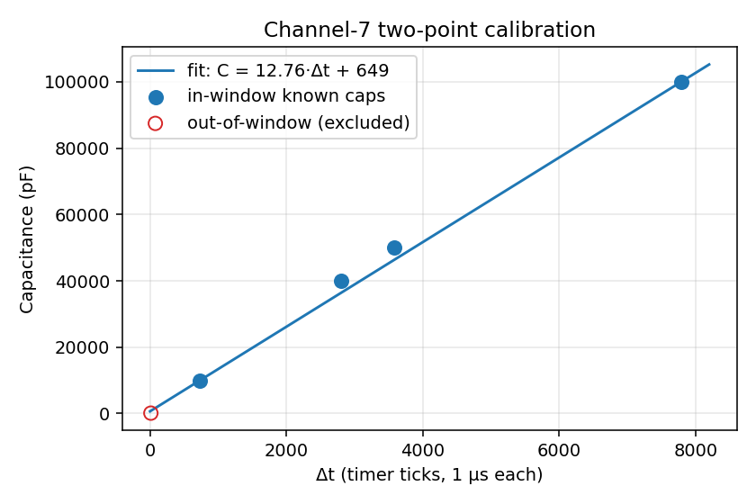

# Objective

To build an instrument that measures capacitance with an 8-bit microcontroller,
which cannot read capacitance directly but can time intervals precisely. The
unknown capacitor is converted into a charge-time, measured by a hardware timer,
displayed locally, and streamed over Bluetooth — with **automatic ranging** so a
single device covers many decades of capacitance.

# Method and setup

## Measurement principle

A capacitor $C_x$ is charged through a known resistor $R$; its voltage follows
$v(t)=V_{cc}(1-e^{-t/RC})$. Instead of timing to a single level (which would
depend on $V_{cc}$), we time the **interval between two supply-referenced
thresholds**, $\tfrac13 V_{cc}$ and $\tfrac23 V_{cc}$. The supply then cancels:

$$
\Delta t = RC\ln\frac{V_{cc}-\tfrac13V_{cc}}{V_{cc}-\tfrac23V_{cc}} = RC\ln 2
\quad\Longrightarrow\quad
\boxed{\,C = \dfrac{\Delta t}{R\ln 2} = \dfrac{\Delta t}{0.693\,R}\,}
$$

So $C$ depends only on a known resistor, a measured time, and a constant — not
on the supply, the comparator's trip point, or temperature.

## What was built

```
   Cx ─ R(range) ─ node ─► analog comparator ─► Timer1 input capture
            ▲                     ▲
       CD4067 mux         ⅓ & ⅔ Vcc divider
     (auto-range R)               │
                                  ▼
   7-seg display ◄─ SPI/595   HC-06 ◄─ USART (Bluetooth)
```

- **MCU:** ATmega328P at 8 MHz. The on-chip **analog comparator** drives the
  **Timer1 input-capture** unit, which latches the charge time in hardware
  (no interrupt jitter).
- **Thresholds:** the comparator's negative input is switched via the ADC
  multiplexer between $\tfrac13V_{cc}$ and $\tfrac23V_{cc}$ taps from a
  three-resistor divider; only one register write changes the threshold.
- **Auto-ranging:** a **CD74HC4067** 16-channel mux selects one of **eleven
  measured resistors (10 Ω – 5.6 MΩ)**. Firmware picks the channel that keeps
  the timer count in a good window ($200 \le N \le 58000$ ticks), using a
  warm-start + interpolation search that converges in ~1–3 trials.
- **Output:** a 4-digit seven-segment display driven over hardware SPI through
  shift registers, plus an **HC-06 Bluetooth** link that streams readings and
  lets a host PC trigger measurements.

| Signal | Pin | Role |
|:--|:--|:--|
| Charge / discharge | PB0 | HIGH = charge through $R$, LOW = discharge |
| Node sense | PD6 (AIN0) | comparator (+) |
| Thresholds | PC4 / PC3 | $\tfrac13V_{cc}$ / $\tfrac23V_{cc}$ (comparator −, via ADC mux) |
| Range select | PC0–PC2, PD7 | CD4067 channel (S0–S3) |
| Display / BT | PB2,3,5 / PD0,1 | SPI to 595s / HC-06 UART |

## Procedure

Each reading discharges the capacitor, then times one charge from $\tfrac13$ to
$\tfrac23 V_{cc}$; **30 cycles are taken and a trimmed mean** (drop 3 high + 3
low) reported, suppressing comparator jitter. The tick count is converted with a
calibrated **affine** law $C = a\,\Delta t + b$, where the slope absorbs the
clock and resistor errors and the intercept absorbs stray capacitance. The
constants $a,b$ are fixed by **two known capacitors** (a single point cannot, as
a non-zero offset is present).

# Results

## Calibration (single range, $R=99.3\ \text{k}\Omega$)

Trimmed-mean intervals for known capacitors gave a clean straight line with a
**non-zero intercept**, confirming the affine model. The two-point fit (10 nF,
100 nF):
$$
a = \frac{100000-10000}{7788-733} = 12.76\ \text{pF/tick},\qquad
b = +650\ \text{pF}.
$$

{#fig-cal width=58%}

Each point is the **trimmed mean of 30 charge cycles** (3 highest + 3 lowest
dropped); the median is shown as a cross-check of repeatability:

| Capacitor | mean $\Delta t$ | min | max | median | spread |
|:--|--:|--:|--:|--:|--:|
| 100 pF | 12 | 12 | 13 | 12 | (out of window) |
| 10 nF | 733 | 696 | 760 | 736 | 8.7 % |
| 104 ceramic | 2802 | 2665 | 3360 | 2802 | 24.8 % |
| 50 nF | 3579 | 2943 | 4048 | 3587 | 30.9 % |
| 100 nF | 7788 | 6780 | 9228 | 7777 | 31.4 % |

The complete 30-cycle runs (Δt in ticks; comparator jitter visible, hence the
trimmed mean; **bold** = the two calibration anchors):

```
100pF: 13 12 12 12 12 12 13 13 13 13 12 12 12 12 12
       12 12 12 12 12 12 12 12 13 12 13 13 13 12 12                                         ->12
10nF : 732 699 709 735 746 749 744 731 759 738 721 707 719 729 732
       737 760 749 736 734 742 727 696 715 740 740 738 713 755 744                          ->733  *
104  : 3360 2700 2881 2809 2826 2744 2774 2903 2799 2811 2828 2802 2734 2813 2882
       2777 3082 2790 2839 2755 2795 2698 2790 2665 2771 3088 2670 2851 2812 2774           ->2802
50nF : 3676 3637 3590 3695 3651 3516 3661 3706 3344 4048 3572 3587 3550 3491 3501
       3495 3423 3508 3547 3510 3721 3511 3714 3601 3648 2943 3493 3360 3616 3758           ->3579
100nF: 9228 7637 7661 7940 8097 7713 7864 7524 7536 8687 7775 7954 8048 7912 7807
       7972 7681 7687 7586 7674 7837 8230 7877 7866 7777 7759 6873 6780 7659 7594           ->7788 *
```

## Auto-ranging (100 pF – 470 µF)

The meter selected an appropriate range for every capacitor across seven
decades:

| Capacitor | Channel | Reading | Note |
|:--|:--|--:|:--|
| 0.33 µF | R3 (980 Ω) | 0.337 µF | accurate |
| 1 µF | R5 (9.86 kΩ) | 0.975 µF | accurate |
| 10 µF | R4 (5.5 kΩ) | 8.76 µF | within electrolytic tolerance |
| 47 µF | R3 | 46.5 µF | accurate |
| 220 µF | R1 (56 Ω) | **715 µF** | error — see below |
| 680 µF | R0 (10 Ω) | overflow | beyond range |

The range-selection logic was correct in every case; accuracy is excellent
wherever the multiplexer resistance is negligible.

## Key finding: multiplexer on-resistance

The errors at the smallest resistors are caused by the multiplexer's series
**on-resistance** $R_\text{on}$. From the 220 µF reading,
$R_\text{eff} = \Delta t/(C\ln 2) \approx 207\ \Omega$ versus a nominal 56 Ω, so
$R_\text{on}\approx 150\ \Omega$ — matching the datasheet. The error scales as
$(R_\text{nom}+R_\text{on})/R_\text{nom}$: negligible (+0.15 %) at 99 kΩ but ~3.7×
at 56 Ω, which explains both the 220 µF over-read and the 680 µF overflow. A
software calibration model independently confirmed $R_\text{on}\approx
75$–$150\ \Omega$ and a ~600 pF stray offset.

# Conclusions

A supply-independent, auto-ranging capacitance meter was successfully built and
validated from **100 pF to 470 µF**. The two-threshold method cancels the supply
voltage, automatic ranging keeps every measurement at good timer resolution, and
a two-point affine calibration corrects the systematic error in the mid range.

The dominant limitation is the multiplexer **on-resistance (~150 Ω)**, which
degrades the low-resistance (large-capacitor) ranges. Three improvements follow
directly: (i) use **measured effective resistances** ($R_\text{nom}+R_\text{on}$)
in the calibration table; (ii) switch to a **coarser timer prescaler** on the
large-capacitor ranges to avoid overflow; and (iii) calibrate with **film
reference capacitors across ranges** (and a crystal timebase) for uniform
accuracy across all seven decades.
